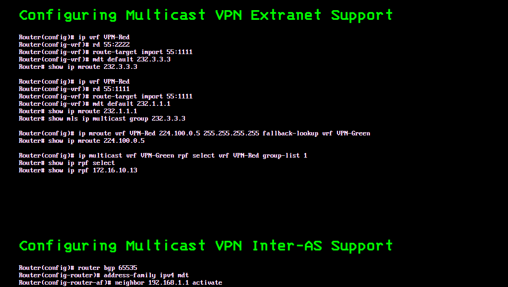
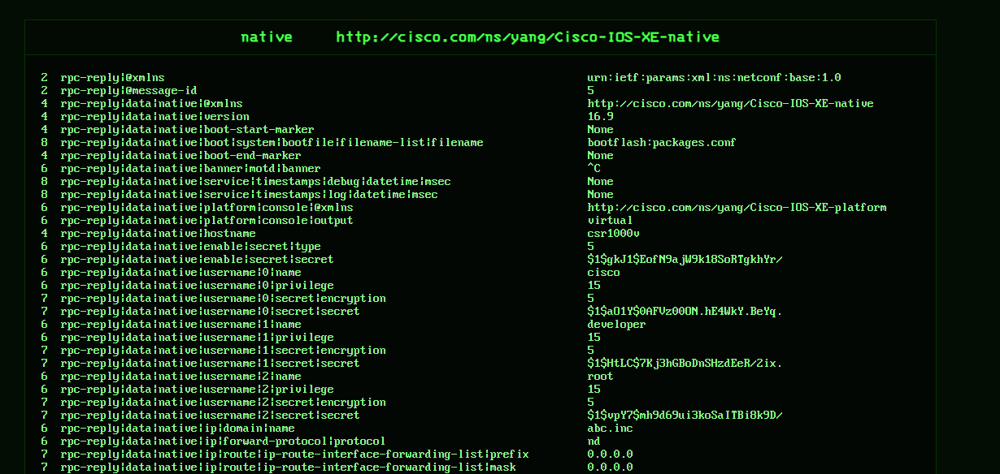
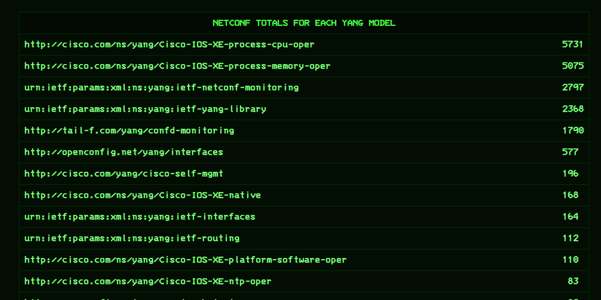

# TWO WEB PAGES

## CISCO COMMANDS

I made two configuration guides that shows only the commands so I can get a clearer high-level view of the various Cisco Commands without the cruft around it, which I think would be helpful for Network Administrators, and which illustrates the power of automation to do this as well as automate Networks themselves (SDN). I think this would be valuable for current Network Admins or anyone coming up in the field, and it shows the power of the Cisco IOS in one place, where they could then transition into other vendors.

The two web pages are for:

Cisco CSR1000v

Cisco NEXUS Data Center & MDS Storage Switches

If you want the Source Code or you have any questions, send me a message!

| Symbol                                         | Purpose                                                                                                                                                                                                                                                |
| ---------------------------------------------- | ------------------------------------------------------------------------------------------------------------------------------------------------------------------------------------------------------------------------------------------------------ |
| class WebPage                                  | The Superclass that subsequent subclasses will be deriving from. It has just one function which retrieves the HTML file that holds the configuration command.                                                                                          |
| class InformationPage                          | Represents the page with the Cisco Command                                                                                                                                                                                                             |
| class TableOfContents                          | Collection of Pages with cisco Commands                                                                                                                                                                                                                |
| class ConfigurationGuide                       | Collection of Table Of Contents                                                                                                                                                                                                                        |
| function record_cisco_commands                 | Iterates through this chain outlined above                                                                                                                                                                                                             |
| function record_cisco_commands_by_toc_url_list | Very similar behavior to the above, but instead you can send a list of TableOfContents as a parameter/argument to get the commands. This was how I got the commands for the Cisco Nexus & MDS. Offers more flexibility when the situation calls for it |

## NETCONF WEB PAGE REFERENCE GUIDE

In September 2019, I happily made a NETCONF client using SSH just to get acclimated with NETCONF, since I knew it was a Southbound API to control the configuring of routers. I don't know why I didn't use NCClient which already existed, I was experimenting sending raw SSH/XML in NETCONF and using Paramiko seemed better and more educational for my aims (I'm not replacing NCCLIENT).

In doing so, I wanted to do something more elaborate with this base NETCONF class that I made, so I simply got the XML of many different YANG Models that existed, and put the results in the webpage using Jinja2 Templates.

I used a function in another repo (Helper_Functions) to parse the NETCONF into a text layout that makes the XML infinitely easier to read in a high level view. It gives the path of each XML value & leaf, to easily imagine what is in the resulting XML, which makes NETCONF more practically useful, and more helpful to understand the Network Device. This was done for the top level NETCONF Yang Models.

Also, I made a separate table in the bottom of the page to list which Yang Models returned the largest XML files, to get a higher-level view of the data in the network device.

